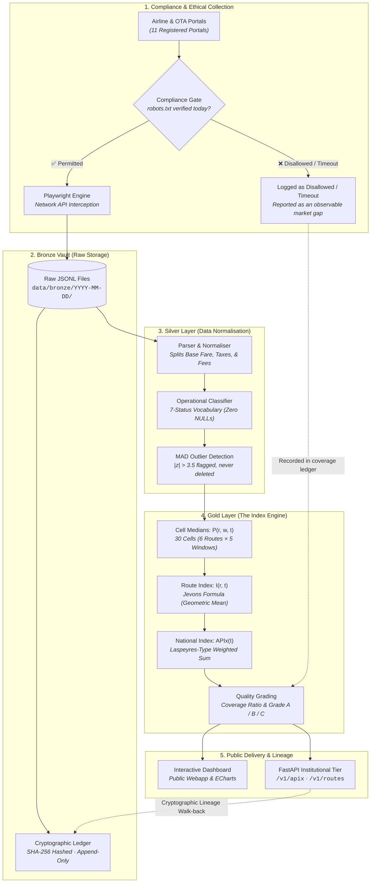

# ✈️ APIx — Real-Time Airfare Price Index for India

> **A high-frequency, statistically rigorous price index designed to measure daily airfare movements across India's major domestic routes — built to augment the Consumer Price Index (CPI).**

<p align="center">
  
  
  
  
  
  
</p>

---

## 🧭 The 30-Second Summary

### How India Measures Airfares Today
Currently, the Ministry of Statistics and Programme Implementation (**MoSPI**) tracks domestic airfares using **one single monthly number** in the Consumer Price Index:
* Item: *"Air fare [normal]: economy class [adult]"*
* Basket Weight: **0.08** (Base 2012 = 100)
* Frequency: **Monthly**

### The Challenge
Air travel does not follow a monthly heartbeat. Across India's 1,100+ domestic city pairs, airline algorithms adjust ticket prices constantly. Flight fares can fluctuate by 300% to 500% in a single day based on festivals, weather disruptions, fuel price revisions, and booking lead times. A single monthly average is blind to these daily surges.

### What APIx Does
**APIx** replaces this blind spot with a **daily economic instrument**:
* 📅 **30 observations every day** — tracking **6 key routes** across **5 booking advance windows** (T+1 to T+45).
* ⚖️ **Built like official CPI statistics** — using internationally accepted index formulas (Jevons geometric medians within routes, Laspeyres arithmetic averages across national routes).
* 🛡️ **100% compliant & auditable** — every single price links to an immutable raw JSON file with a SHA-256 cryptographic fingerprint.

> [!IMPORTANT]  
> **The Framing:** APIx is **not** a web scraper that computes an index. It is an **official economic measurement instrument** that observes market prices from the public web.

---

## 💡 A Surprising Discovery: The "U-Shaped" Booking Curve

Conventional wisdom suggests that flight tickets simply get cheaper the earlier you book. **Our real-world collected data proved otherwise.**

When tracking fares across lead times, APIx observed a distinct **U-shaped price curve**:

```
 Fare (₹)
  ▲
  │   ₹14,781 (T+1) ── Last-minute business surge
  │     \
  │      \    ₹10,500 (T+7)
  │       \     \
  │        \     \                      ₹9,800 (T+45) ── Advance buffer
  │         \     \                    /
  │          ─── ₹9,043 (T+21) ───────
  │             (Sweet Spot)
  └──────────────────────────────────────────────────────────► Advance Window
```

* **Last-Minute Surge (T+1):** Fares spike sharply to a median of **₹14,781** (+63.4% premium).
* **The Sweet Spot (T+21):** Fares bottom out at **₹9,043** — matching MoSPI's own recommended 3-week domestic collection window.
* **The Early-Bird Trap (T+45):** On 4 out of 6 routes, booking 45 days ahead is actually **more expensive** than booking 21 days ahead, because airlines protect long-range revenue buckets.

*No official statistical agency currently publishes booking-window curves. APIx provides this out of the box.*

---

## ⚙️ How APIx Works (The 4-Stage Pipeline)

APIx processes web observations into national economic statistics using an auditable, multi-stage architecture:



1. **🛡️ The Compliance Gate:** Before a browser instance even spins up, APIx downloads and hashes the portal's `robots.txt`. If permissions are not explicitly clear today, collection stops immediately.
2. **📦 Bronze (The Raw Vault):** Network interception captures the airline's raw fare response verbatim. These payloads are immutable — once written, they are never modified.
3. **🧹 Silver (Cleaned Quotes):** Extracts base fare, taxes, and fees. Every quote is tagged with one of seven strict operational statuses. Outliers are flagged (using Median Absolute Deviation), never deleted.
4. **📈 Gold (The Published Index):** Computes cell medians, calculates price relatives against base date, aggregates routes geometrically, and produces the final national APIx number.
5. **🌐 Delivery:** Serves the high-speed dashboard, OpenAPI endpoints, and cryptographic provenance trails to MoSPI, RBI, and researchers.

---

## 🏛️ Our 5 Non-Negotiable Principles

| Principle | Why It Matters |
|---|---|
| **1. Median, Not Mean** | Airfares are heavily skewed by expensive business-class seats and surge pricing. In a sample of 221 quotes for DEL-BOM, the mean was ~₹8,900 — a price almost nobody paid. The median was **₹7,675**, reflecting actual consumer reality. |
| **2. No Empty NULLs** | A sold-out flight is a **market event** (`SOLD_OUT`). A broken Wi-Fi connection is a **system error** (`FETCH_FAIL`). APIx uses a strict 7-status vocabulary so coverage reports remain completely transparent. |
| **3. Strict Legal Compliance** | We collect **only** where permissions and `robots.txt` permit. We do not solve CAPTCHAs, bypass bot shields, or rotate proxies. If a portal restricts access, we record it honestly as an unobserved market gap. |
| **4. Zero Black-Box AI** | There is **no machine learning** in the index calculation. A national statistics bureau must defend every single figure before parliament and policy makers; an opaque neural network cannot be audited. |
| **5. 100% Cryptographic Provenance** | Every single index figure published on the dashboard can be walked backwards to the exact byte, timestamp, and SHA-256 hash of the airline response it came from. |

---

## ✈️ What We Measure Every Day (The Basket)

APIx tracks **30 distinct market cells** daily (6 Routes × 5 Booking Windows):

### 6 Domestic High-Traffic Hub Routes
* 🛫 **DEL ⇄ BOM** (Delhi – Mumbai)
* 🛫 **DEL ⇄ BLR** (Delhi – Bengaluru)
* 🛫 **BOM ⇄ BLR** (Mumbai – Bengaluru)
* 🛫 **DEL ⇄ CCU** (Delhi – Kolkata)
* 🛫 **BLR ⇄ HYD** (Bengaluru – Hyderabad)
* 🛫 **MAA ⇄ DEL** (Chennai – Delhi)

### 5 Booking Advance Windows
* **T+1** (1 day out) — Urgent & emergency travel
* **T+7** (1 week out) — Near-term domestic travel
* **T+14** (2 weeks out) — Planned leisure & corporate trips
* **T+21** (3 weeks out) — Standard reference window (matches MoSPI domestic standard)
* **T+45** (45 days out) — Long-term advance holiday bookings

*Standard Specification Held Constant: 1 Adult passenger, economy class, non-stop flight, lowest available fare product.*

---

## 🚀 Quick Start (Running APIx Locally)

Bring up the complete system — database, archive, index, and web dashboard — in **under 2 minutes**.

### 1. Install Dependencies
```bash
# Clone the repository
git clone https://github.com/mayankmalik263/apix.git
cd apix

# Install Python requirements (Python 3.12 recommended)
pip install -r requirements.txt
python -m playwright install chromium
```

### 2. Cold-Start Bootstrap
Builds the SQLite database, verifies schemas, unpacks seed data, and calculates all historical indices in one command:
```bash
python -m scripts.bootstrap
```

### 3. Launch Dashboard & API
```bash
python -m webapp.run
```
Now open your browser:
* 📊 **Interactive Dashboard:** <http://localhost:8000/>
* 🎛️ **Operator Console:** <http://localhost:8000/console>
* 📖 **Interactive API Docs:** <http://localhost:8000/docs>

> [!TIP]
> **One-Command Live Demo:**  
> You can also run the complete automated pipeline (compliance check ➔ live collection ➔ silver parse ➔ gold index ➔ web server) with:  
> `python -m apix.cli demo`

---

## 🔌 Easy-to-Use APIs for Economists & Developers

APIx provides clean REST endpoints designed for integration with central banks, statistical agencies, and economic models.

### Example: Fetch Today's National Airfare Index
```bash
curl http://localhost:8000/v1/apix/latest
```

#### Response (JSON)
```json
{
  "date": "2026-09-08",
  "apix": 94.263,
  "change_pct": -7.80,
  "base_date": "2026-09-03",
  "coverage": "30/30",
  "confidence_grade": "B",
  "weights_provisional": true,
  "source_class": "LIVE",
  "status": "PUBLISHED"
}
```

### Key API Endpoints

| Endpoint | Method | Description |
|---|---|---|
| `/v1/apix/latest` | `GET` | Today's national index, inflation rate, and confidence grade |
| `/v1/apix/series` | `GET` | Historical daily time-series with simulated/live tags |
| `/v1/routes/{code}/series` | `GET` | Route-level price trajectory (e.g. `DEL-BOM`) |
| `/v1/windows/curve` | `GET` | Median fare curve across the 5 lead-time windows |
| `/v1/lineage/{date}/{route}/{window}` | `GET` | Full audit trail: Gold index ➔ Silver fare ➔ Bronze raw hash |
| `/v1/compliance/report` | `GET` | Real-time permissions & `robots.txt` compliance ledger |

---

## 🔒 Three Tiers of Access

| Tier | Path | Access | Purpose |
|---|---|---|---|
| **1. Public Citizen Tier** | `/` & `/public/*` | **Open** (Rate-limited) | Public dashboard with charts, methodology notes, and index values. No login required. |
| **2. Institutional Tier** | `/v1/*` | **API Key** | High-throughput data feeds for MoSPI, RBI, and researchers. Enforces scopes (`read:index`, `read:lineage`). |
| **3. Operator Console** | `/console` | **Authenticated Session** | Administrative dashboard for key issuance, crawler status, and scheduler audits. |

---

## 📐 Mathematical Formulation (In Plain English)

The math behind APIx mirrors international best practices for Consumer Price Indices:

1. **Cell Median:** For any given route and booking window on date $t$, we take the median of valid fares:
   $$P(r, w, t) = \text{median}\{\text{fares with status } OK\}$$
2. **Price Relative:** We compare today's median against our base period (3 September 2026 = 100):
   $$R(r, w, t) = \frac{P(r, w, t)}{P(r, w, \text{base})}$$
3. **Route Index (Jevons Formula):** Booking windows are ratios, so they combine **geometrically**. A doubling and a halving cancel out cleanly to 100:
   $$I(r, t) = 100 \times \left( \prod_{w=1}^{W} R(r, w, t) \right)^{1/W}$$
4. **National Index (Laspeyres-Type Formula):** Routes represent expenditure budget shares, so they combine **arithmetically**:
   $$\text{APIx}(t) = \sum_{r} \omega_r \cdot I(r, t), \quad \sum \omega_r = 1$$

---

## 📁 Repository Structure

```
apix/
├── apix/                   # Core index & collection engine
│   ├── collect/            # Compliance gate, network adapters, Bronze storage
│   ├── load/               # Bronze-to-Silver parser & outlier tagging
│   ├── index/              # Mathematical calculation engine (Gold layer)
│   ├── api/                # FastAPI application & v1 endpoints
│   ├── web/                # User authentication, scheduler, and API keys
│   └── cli.py              # Single command-line interface
├── config/
│   └── basket.yml          # Route definitions, advance windows, and weights
├── compliance/             # Registered portals, dated verdicts, and hashed robots.txt
├── data/                   # Seed raw JSONL files and manual collection templates
├── db/                     # SQLite development schema & PostgreSQL production schema
├── scripts/                # Cold bootstrap, dry run validator, and MoSPI extractors
├── webapp/                 # Interactive frontend dashboard (ECharts vendored, zero npm)
└── tests/                  # 57 automated tests covering math, parser, and compliance
```

---

## 🤝 Transparency & Stated Limitations

We believe that integrity is the foundation of public statistics. We state our constraints openly:

1. **Real Collection Window:** Real automated daily collection was conducted on **3, 4, and 8 September 2026**. Prior history (91 days) is clearly watermarked as `SIMULATED` to demonstrate chart behaviour without contaminating live statistics.
2. **Provisional Route Weights:** All six routes currently carry equal weight ($1/6$), flagged as `weights_provisional = true`, pending final city-pair passenger volume data from DGCA.
3. **Compliance Coverage:** Out of 11 registered domestic sources, **6 are actively permitted**. 5 sources encountered read timeouts during verification and are logged as unverified gaps rather than bypassed.

---

## 👥 The Team

**Smart India Hackathon 2026** — Problem Statement **SIH26056**  
**Organisation:** Ministry of Statistics & Programme Implementation (MoSPI)  
**Team:** `TouchGrass.exe` · UPES Dehradun  

* **Mayank Malik** — Team Lead · System Architecture, Compliance Gate, Collection Pipeline, Dashboard & API  
* **Bharat** — Database Architecture, Storage Pipeline, Index Engine & Webapp  
* **Ayush** — Mathematical Formulation, Index Methodology & Computational Framework  
* **Vidushi** — Presentation Deck, Research & Data Validation  
* **Riya** — Presentation Deck, Research & Data Validation  
* **Kritika** — Presentation Deck, Research & Data Validation  

---

<p align="center">
  <b>APIx — Built with statistical integrity for the future of Indian economic data.</b>
</p>
